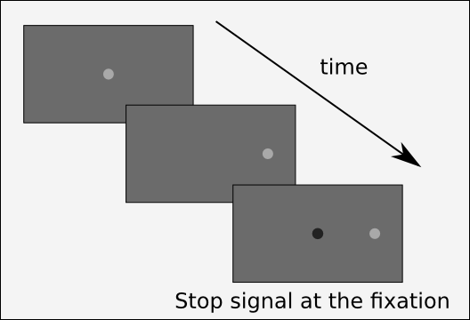

```{r setup, include=FALSE}
knitr::opts_chunk$set(echo = FALSE)
```

<!-- plan 
0. Variability in RT and Space
  
A. Unifying micro-saccade and macro-saccade 
  1. Annie's experiment, stop signal with DINASAUR
    - the model was making small saccades
    - they needed to remove the threshold for small saccade
    - show the behaviour of Dinasaur
  2. Hafed: micro-saccade and micro-saccade are controlled by SC
    - so why is it so bad to have small saccades? 
    - too many of them!
    - not small enough?
    - the model generate only one saccade!
  3. Solution
    - Sequence of eye movements
    - Exponential threshold
    - Stochastic threshold
    - Both together (show the assymetric curve)
  4. Speak of the way to parametrize
    - pass the membrane potential noise to threshold noise

B. Unifying Dip effect and Global Effect
  1. Dip effect in Micro- and macro saccade
  2. Global effect during the Dip effect in macro and micro
  3. Paradox of the dip effect with overlapping distractor/target
      - no results from Aline
      - results from blabla
  4. Solution
    - Saccade averaging
    - Saccade initiation (exc and inh OPN)
-->

## Some definitions
**Noise** is defined by a task, which defined a signal. It is anything that is not relevant to the current task/aim. Noise can be predictible (music) or not (stochastic events); in its simplest form, it is a distractor.

**Variability** is simply the fact that something varies. Not necessarily the effect of noise or randomness.

**Randomness** is a mathematical concept that equals to a uniform distribution of probability over minus to plus infinity. That ideal may not exist in nature; and computer-algorithm can only make pseudo-random generator.

**Stochastic processes**:  they are natural processes, likely underlined by deterministic processes, that generates a variability that is not fully predictable *by human beings* or not fully predictable at the current level of description/observation.

**Random processes** are the result of using a *random generator* (uniform) with the cumulative of a density distribution (poison, normal) to obtain a shaped variability. These are used to generate a variability that simulates the one of a stochastic process.


## Unifying micro-saccades and macro-saccades
### Annie's experiment



## Slide with R Output

```{r cars, echo = TRUE}
summary(cars)
```

## Slide with Plot

```{r pressure}
plot(pressure)
```

